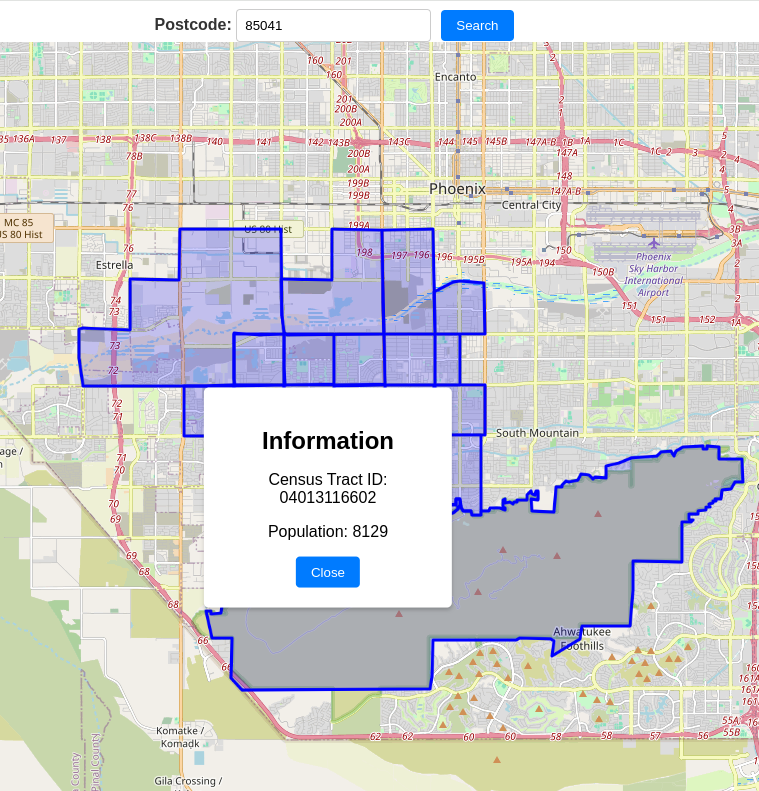

# Data sets

# Census data

Downloaded from https://screeningtool.geoplatform.gov/en/downloads

* 1.0-codebook.csv
* 1.0-values.csv

# Census ShapeFile

Downloaded from https://screeningtool.geoplatform.gov/en/downloads

* usa.cpf
* usa.dbf
* usa.prj
* usa.shp
* usa.shx
  (Shapefile sources, a way to use is import into PostGIS file and then convert into GeoJSON)

Steps to import into postgres

```
shp2pgsql -I -s SRID -W "latin1" usa.shp public.usatable | PGPASSWORD=password psql -U postgres -d gisdb -h localhost
```

Query to convert to geojson
```
select geoid10,
ST_AsGeoJSON(ST_Transform(ST_SetSRID(geom, 4326), 4326)) AS geojson
from usatable
```

# Postcode to Census Track

* us_zip_codes_to_census_tracts.csv

# Postcode to GeoJSON Edges (Not in use yet)

* usa_zip_codes_geo_15m.json

# How to use it

Run
```
docker-compose up
```

and goes to http://localhost:3000

The initial screen is something like the image above, and you can search for valid postcodes in US




This is a sample output from the API, located on http://localhost:8080/search?postcode=10010
```
{
  "postcode": "10010",
  "census_tract_2010_ids": [
    "36061008700",
    "36061005800",
    "36061006000",
    "36061006400",
    "36061005200",
    "36061005600",
    "36061005400",
    "36061006600",
    "36061006800",
    "36061006200",
    "36061005000",
    "36061009100",
    "36061004402"
  ],
  "census_data": {
    "geojson": {
      "type": "FeatureCollection",
      "features": []
    },
    "census_tract": "36061009100",
    "state": "",
    "county": "New York County",
    "total_population": 6298,
    "median_housing_value": 1541900
  }
}
```
